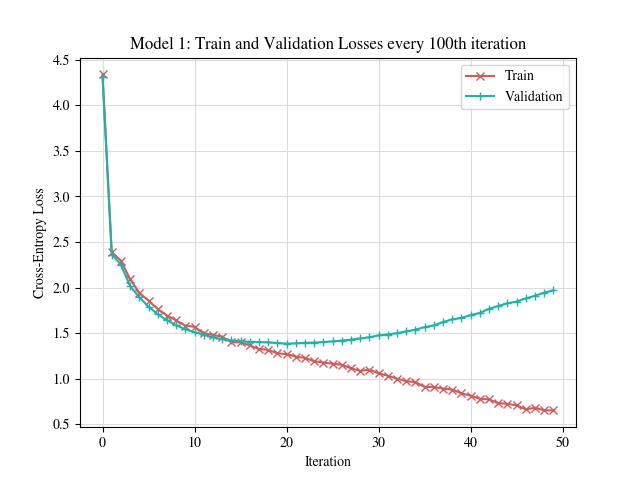
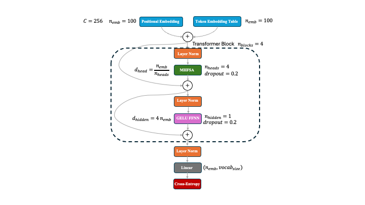

# Dante GPT
A transformer-based language model trained on Dante Alighieri's Divina Commedia. The model is strongly inspired by Andrej Karpathy's nanoGPT, which is itself a simplified version of GPT-2.

<p align="center">

</p>

# Data
The simplest way to download yourself this data is to open a Jupyter Notebook (if you are using a Conda environment, remember to install `wget`) and run
```python
!wget https://dmf.unicatt.it/~della/pythoncourse18/commedia.txt --no-check-certificate
```


# Models
### Model 1
Model 1 is pretty much identical to nanoGPT in the MakeMore series by Andrej Karpathy. It uses a simple lookup table as token embedding with `n_emb=384`, implemented with `nn.Embedding(vocab_size, n_emb)`. These `384`-dimensional token embedding vectors are added to `384`-dimensional positional embedding vectors, obtained with `nn.Embedding(context_size, n_emb)`. The resulting embedded vectors contain both positional and identity information. These are fed through `6` Transformer blocks. Each transformer block starts with a `LayerNorm`, then the input is fed through `MultiHeadSelfAttention` using `6` heads with latent dimension (i.e. the dimension of the keys, queries and values) of `d_head=n_emb/n_heads=64`. The results of the `6` heads are aggregated with a linear projection `nn.Linear(n_emb, n_emb)` and a `dropout` with rate `0.2` is applied. In this model we use `self-attention`, i.e. this is a `decoder-only` architecture. After the dropout, we use a `residual/skip connection`, go through another `LayerNorm` and through a one-hidden-layer `Feed-Forward Neural Network` with `ReLU` activation function, `4 n_emb` hidden units and dropout of `0.2`. Then this is fed through another `residual/skip connection`. This is all repeated `6` times. After the sixth block, we use one last `LayerNorm`, a `Linear` layer to project back onto a space of dimension `vocab_size` and this is fed through the `cross-entropy` loss.

<p align="center">

</p>

After training the model for `5000` iterations, this is the first 500 characters that it generated from `Virgilio`. It does very much resemble the Italian language at that time and even has some rhymes :) 
```text
Virgilio
fosse che sempre la gente a costa parte
sovra 'l quale il fé chiaro chiude,
  ma però che non mi fia desse resplende,
che di lui dicesse a Dio: '   Bonedes   '
al maestro suo per lui vostro menie!
  Qui vivi mi cinto in basso a questo carto
per lo novo che 'ntelletto tu deschiere
sen vanno grazie sì fatta brevi,
che sien vuole esser non chi eren martìri.
  Ma dimmi, dove sien padri vere,
ch'i' son morti la pietade al chiostro
più alto che stelle novità reschiere.
  Ma voi che sappi che sì s'inn
```
Currently, the model is overfitting, which makes sense given a lot of the design choices.

<p align="center">

</p>

### Model 2
The second model differs from Model1 in only two ways: it uses a GeLU activation function and it implements Flash attention. Importantly, inside flash attention it also uses a dropout of `0.2` at training time.

<p align="center">

</p>

Model 2 is also over-fitting. I have trained exactly the same architecture but smaller model, with `context_size = 256`, `n_emb = 192`, `num_layers = 4`, and `num_heads = 4`. Training this model over 5000 iterations did not overfit as much and achieved lower final test loss.


# Moving Forward

1. Implement [FlashAttention](https://arxiv.org/abs/2205.14135), which computes *exact* self-attention but can bring important speed ups. See [HuggingFace](https://huggingface.co/docs/text-generation-inference/en/conceptual/flash_attention) for a simple, quick explanation.
2. GeLU activation functions: ReLU suffers from the problem of "dead ReLU" neurons, meaning that a large portion of the network might not be doing any learning. GeLU has a small curvature (and thug gradient) everywhere, potentially allowing more efficient learning.
3. [Cope](https://arxiv.org/abs/2405.18719) (Contextual Position Encoding): standard positional encoding simply encodes the position of a token in the context, whereas this allows for higher level of abstractions, e.g. can represent the count of words, verbs, sentences and so on.
4. Various simplification mechanisms, based on [this](https://arxiv.org/pdf/2311.01906) and potentially [this](https://arxiv.org/abs/2403.17887) or even [this](https://arxiv.org/pdf/2401.17948) paper. For example removing some residual connections and LayerNorms.
5. Quantization for speed up and lighter memory.
6. Implement temperature in final softmax to allow for more flexibility at test time.
7. Weight decay on weight tensors, i.e. all the tensors performing a `matmul` operation as well as the embedding, but excluding the biases and LayerNorms. This would be similar to what Andrej Karpathy has done in NanoGPT. Notice that `AdamW` can take group parameters.
8. Learning rate decay scheduler (possibly with cosine warmup).
