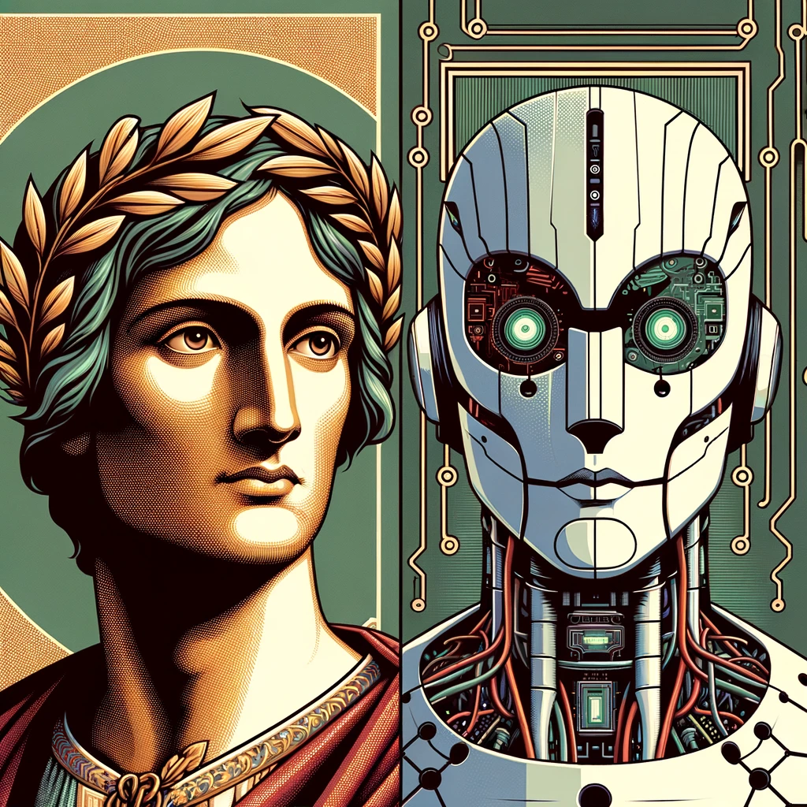

# Dante GPT
A transformer-based language model trained on Dante Alighieri's Divina Commedia. The model is strongly inspired by Andrej Karpathy's nanoGPT, which is itself a simplified version of GPT-2.

# Models

